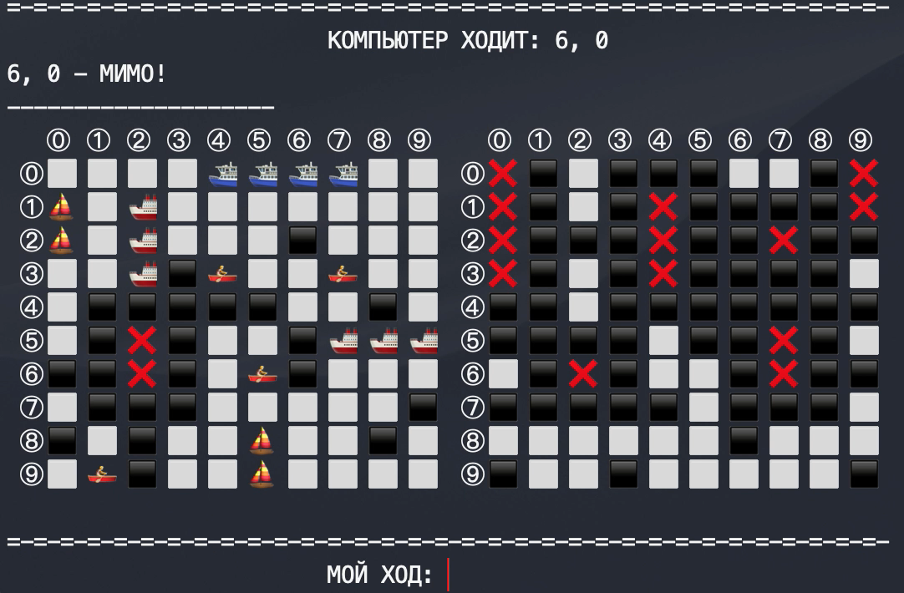

# Sea-Fight on Python3

Game sea fight in the terminal on Python 3.8 against the computer

## Installation

**Python 3.8**:

```sh
git clone https://github.com/streltsovdenis/seafight.git
cd seafight/
python3 app.py
```

**Docker Hub image**: [https://hub.docker.com/r/streltsovd/sea-fight](https://hub.docker.com/r/streltsovd/sea-fight)

```sh
docker pull streltsovd/sea-fight
docker run -it --rm --name sf streltsovd/sea-fight
```

**Dockerfile**:

```sh
git clone https://github.com/streltsovdenis/seafight.git
cd seafight/
docker build -t seafight .
docker run -it --rm --name sf seafight
```

### IMG


